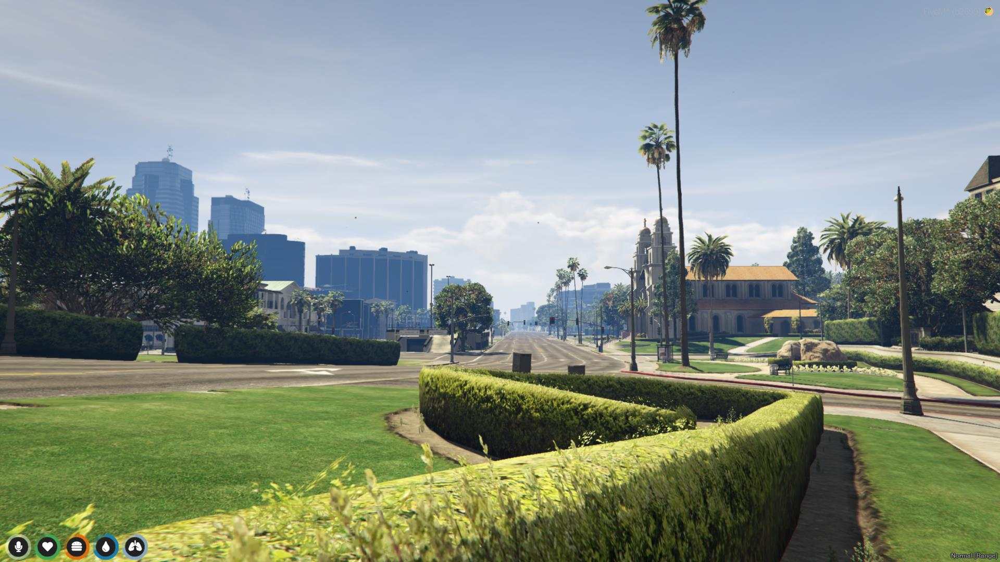

# AI Traffic [Work in progress]

Control the volume of AI vehicle traffic by commands or dynamically based on time (e.g. simulate morning/afternoon traffic peaks).

# Preview

A configuration where AI drivers are completely disabled. Race ON!

# Todo

- [x] Control the amount of AI drivers
- [ ] Admin commands
- [ ] Daily traffic peak simulation

# Install

⚠️ It's not ready yet, so it may not work properly. ⚠️

1. Download the latest stable release, then extract it to the `resources` folder in the server data folder
2. Set the configuration in the `config.lua` file.
3. Add this line to your server configuration:
`ensure fivem-ai-traffic`
4. Restart the server and you're done.
5. Happy racing.